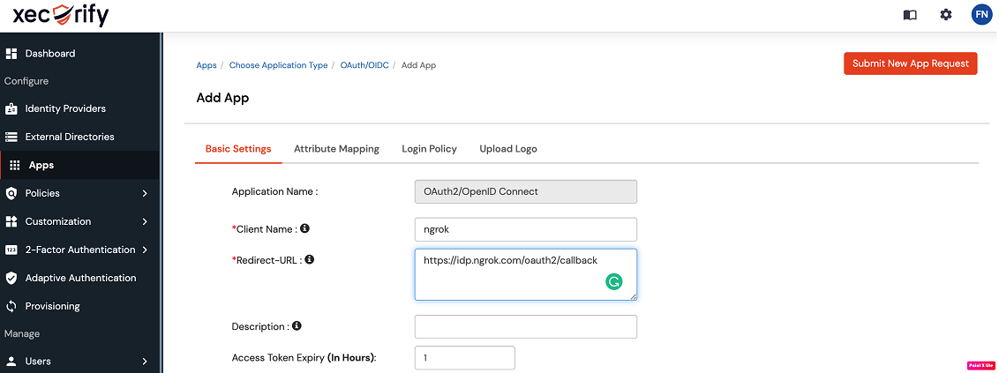
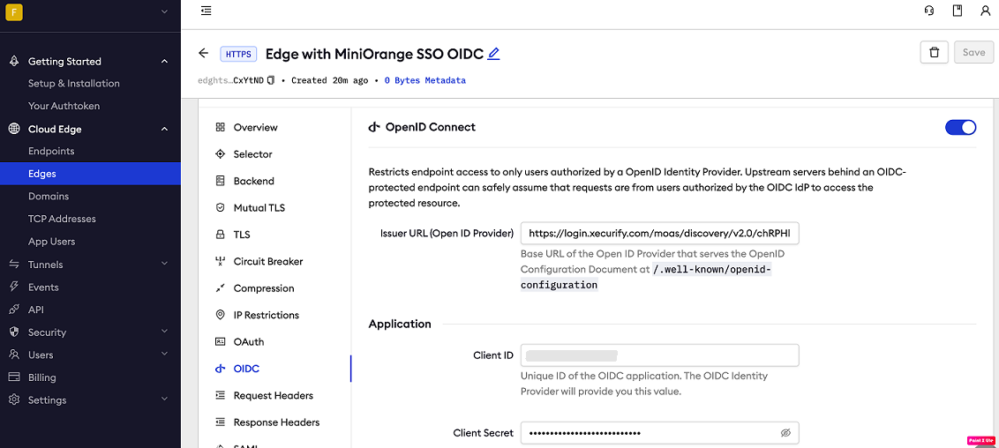

# MiniOrange SSO (OpenID Connect)
------------

:::tip TL;DR

To secure access to ngrok with MiniOrange Single Sign-On using OpenID Connect:
1. [Configure MiniOrange SSO](#configure-miniorange)
1. [Configure ngrok](#configure-ngrok)
1. [Test access to ngrok with MiniOrange SSO](#test-sso)

:::

This article details how to configure MiniOrange as the primary Identity Provider for ngrok tunnels.
By integrating MiniOrange SSO with ngrok, you can:

- **Restrict access to ngrok tunnels** only to users authenticated via MiniOrange.
- **Use MiniOrange security policies and MFA authenticators**.
- **Use MiniOrange's Dashboard to facilitate access to ngrok apps**.

## Supported Features

The ngrok integration with MiniOrange supports:

- **SP-Initiated SSO**: In this mode, users access ngrok edges and tunnels and are redirected to MiniOrange for authentication.

## Requirements

To configure ngrok tunnels with MiniOrange, you must have:

- a MiniOrange account with administrative rights to create apps.
- an ngrok enterprise account with an access token or admin access to configure edges with OpenID Connect.


## Configuration Steps

To integrate ngrok with MiniOrange SSO, you will need to:

1. Configure MiniOrange with the ngrok app.
1. Configure ngrok with the SSO settings provided by MiniOrange.

### **Step 1**: Configure MiniOrange {#configure-miniorange}

1. Access [MiniOrange](https://www.miniorange.com/), and sign in using your MiniOrange administrator account.

1. On the **Dashboard** page, click **Apps** on the left menu, click **Add Application**, click the **OAUTH/OIDC** tile, and then click the **OAuth2/OpenID Connect** tile.

1. On the **Add App** page, enter `ngrok OIDC` in the **Client Name** field, enter `https://idp.ngrok.com/oauth2/callback` in the **Redirect-URL** field, and then click **Save**.
    

1. On the **View Apps** page, click **Select** in the **ngrok OIDC** app line, and then click **Edit**.

1. On the **Edit Application** page, make note of the value of the **Client ID** field, click the **Click to reveal client secret** link, and then make note of the value of the **Client Secret** field.

1. Click **Save**.

1. On the **View Apps** page, click **Select** in the **ngrok** app line, and then click **OAuth Endpoints**.
 
1. On the **OAuth Endpoints** page, make note of the URL of the **Discovery Endpoints** field.


### **Step 2**: Grant access to MiniOrange users

MiniOrange allows its users to access OIDC-integrated apps. To create a user follow the instructions below.

1. On the left menu of the [MiniOrange Dashboard](https://login.xecurify.com/moas/admin/customer/home), click **Users** and then click **User List**.

1. On the **Users** page, click the **Add User**, enter values for the **Email**, **Username**, **First Name**, **Last Name**, and **Password** field, and then click **Create User**.


### **Step 3**: Configure ngrok {#configure-ngrok}

ngrok can leverage MiniOrange SSO in two ways:

- From the ngrok CLI (using the `--oidc` parameter)
- From the ngrok dashboard

### **Option 1**: ngrok CLI

> **Note:** For this tutorial, we assume you have an app running locally (i.e., on localhost:3000) with the ngrok client installed.

1. Launch a terminal

1. Enter the following command to launch an ngrok tunnel with MiniOrange SSO:
    ```bash
    ngrok http 3000 --oidc=MINIORANGE_OAUTH_URL \
    --oidc-client-id=MINIORANGE_CLIENT_ID \
    --oidc-client-secret=MINIORANGE_CLIENT_SECRET \
    ```
    **Note**: Replace the following with values:
    - MINIORANGE_OAUTH_URL: The **Discovery Endpoint** URL you copied from MiniOrange, without the `/.well-known/openid-configuration` sufix (i.e. `https://login.xecurify.com/moas/discovery/v2.0/abcd1234`). 
    - MINIORANGE_CLIENT_ID: The client id you copied from MiniOrange.
    - MINIORANGE_CLIENT_SECRET: The client secret you copied from MiniOrange.
    
    Alternatively, add the `--subdomain YOUR_SUBDOMAIN` argument to get your subdomain.ngrok.io URL, replacing `YOUR_SUBDOMAIN` with your URL of preference.

1. Copy the URL available next to **Forwarding** (for example, `https://MiniOrange-sso-test.ngrok.io`).

1. Skip to **Step 3**

### **Option 2**: ngrok Edge

To configure an edge with MiniOrange:

1. Access the [ngrok Dashboard](https://dashboard.ngrok.com/) and sign in using your ngrok account.

1. On the left menu, click **Cloud Edge** and then click **Edges**.

1. If you don't have an edge already set to add MiniOrange SSO, create a test edge:
    * Click **+ New Edge**.
    * Click **Create HTTPS Edge**.
    * Click the **pencil icon** next to "no description", enter `Edge with MiniOrange SSO OIDC` as the edge name and click **Save**.

1. On the edge settings menu, click **OIDC**.

1. Click **Begin setup** and enter the following values into the fields:
    

    * **Issuer URL**: The **Discovery Endpoint** URL you copied from MiniOrange, without the `/.well-known/openid-configuration` sufix (i.e. `https://login.xecurify.com/moas/discovery/v2.0/abcd1234efG`). 
    * **Client ID**: The client id you copied from MiniOrange.
    * **Client Secret**: The client secret you copied from MiniOrange.

1. Click **Save** at the top, and then click the left arrow to go back to the **Edges** page.

### **Step 4**: Start a Tunnel {#start-tunnel}

1. Launch a tunnel connected to your MiniOrange edge:

    :::tip Note 
    For this step, we assume you have an app running locally (i.e. on localhost:3000) with the ngrok client installed.
    :::

    1. Click **Start a tunnel**.

    1. Click the **copy icon** next to the tunnel command.
        

    1. Launch a tunnel:
        * Launch a terminal.
        * Paste the command but replace `http://localhost:80` with your localhost app address (i.e., `http://localhost:3000`).
        * Click **Enter** and an ngrok tunnel associated with your edge configuration will launch.

    1. To confirm that the tunnel is connected to your edge:
        * Return to the ngrok dashboard
        * Close the **Start a tunnel** and the **Tunnel group** tabs
        * Refresh the test edge page. Under traffic, You will see the message _You have 1 tunnel online. Start additional tunnels to begin load balancing._
        

    1. In the test edge, copy the **endpoint URL**. (You use this URL to test the MiniOrange Authentication)
        


## Test the integration {#test-sso}

1. In your browser, launch an incognito window.

1. Access your ngrok tunnel using the copied endpoint URL (i.e., `https://miniorange-sso-test.ngrok.io`).

1. You should be prompted to log in with your MiniOrange credentials.

1. After logging in, you should be able to see your web app.

